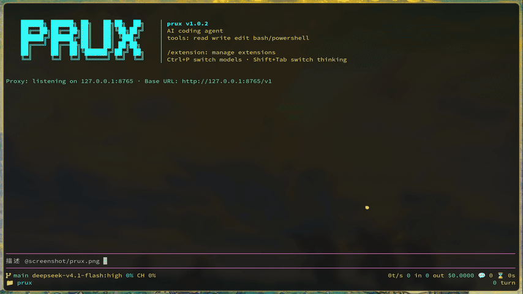
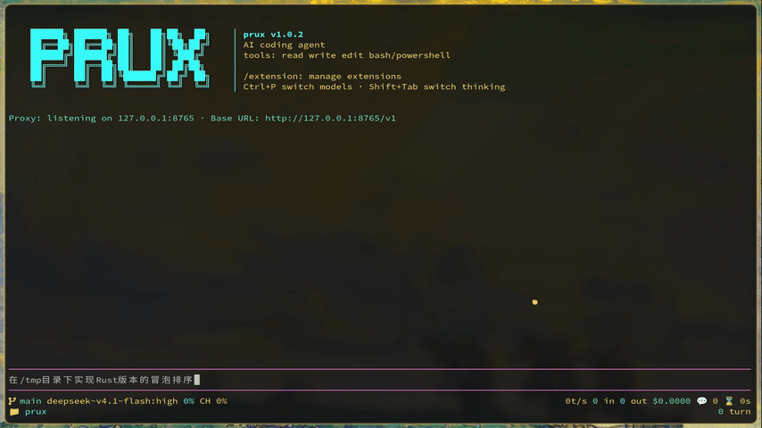

<p align="center">
  
</p>

<p align="center">
  <strong>极简的终端编码助手</strong>
</p>

<p align="center">
    <a href="https://github.com/heng30/prux/releases"></a>
    <a href="LICENSE"></a>
    <a href="Platform"></a>
    <a href="https://doc.rust-lang.org/edition-guide/rust-2024/"></a>
    <a href="Stars"></a>
</p>

<p align="center">
  <a href="README.md">English</a> | <a href="README.zh-CN.md">简体中文</a>
</p>

> ⚠️注意：目前仅测试了`opencode-go`和`deepseek`。

## 简介

`prux` 是一个极简的终端编码助手。核心保持小而专注，通过扩展、技能、提示模板、主题和可定制键位来扩展能力。它是 [@earendil-works/pi-coding-agent](https://github.com/earendil-works/pi) 的 Rust 重写，大部分行为和文案上与上游保持一致。

<p align="center">
  
  
  
</p>

## 特性

- **交互式 TUI**：全屏终端界面，支持主题、快捷键自定义。要求 stdin/stdout 均为 TTY。
- **内置工具**：`read` / `bash` / `edit` / `write` / `grep` / `find` / `ls`，覆盖常见编码任务。
- **多提供商**：支持 Anthropic、OpenAI、DeepSeek 等 API 提供商，可自定义与虚拟模型路由。
- **会话管理**：会话保存、`/resume` 恢复、分支（fork）与树状导航。
- **上下文压缩**：`/compact` 压缩长上下文，支持分支摘要。
- **扩展系统**：用 Rust 实现 `Extension` trait，提供工具、命令、快捷键、CLI flag 与事件钩子。
- **内置扩展**：MCP、子代理（subagent）、codemode（QuickJS 沙箱编排）、技能、定时任务、plan mode 等。

## 安装与构建

```bash
cargo build --release
./target/release/prux --version
```

常用命令：

```bash
make          # cargo build --release
make build    # 仅编译（debug）
make debug    # cargo run
make check    # cargo check
cargo test    # 全量测试
cargo clippy  # 静态检查
```

## 快速开始

```bash
cd /path/to/project
prux
```

首次运行需要在 TUI 内用 `/login` 配置提供商，或在启动前设置环境变量：

```bash
export ANTHROPIC_API_KEY=sk-ant-...
prux
```

设置写入 `~/.prux/`（agent 目录，可用 `$PRUX_AGENT_DIR` 覆盖）：认证 `auth.json`、全局设置 `settings.json` 等。

## 非 TUI 入口

除对话模式外，以下命令不需要 TTY：

- `prux auth`：认证管理
- `prux mcp`：MCP 服务器管理
- `prux --export`：导出会话为 HTML
- `prux --list-models`：列出可用模型

## 文档

完整中文文档位于 [`assets/docs/`](assets/docs/)，编译期内嵌并在运行时同步到 agent 目录。入口见 [`assets/docs/index.md`](assets/docs/index.md)，快速上手见 [`assets/docs/quickstart.md`](assets/docs/quickstart.md)。

## 从源码参与贡献

开发约定、模块分层与构建细节见 [`AGENTS.md`](AGENTS.md)。上游对齐节奏记录在 `sync.md` 与 [`migrations/`](migrations/)。

## 许可证

MIT，见 [`LICENSE`](LICENSE)。
